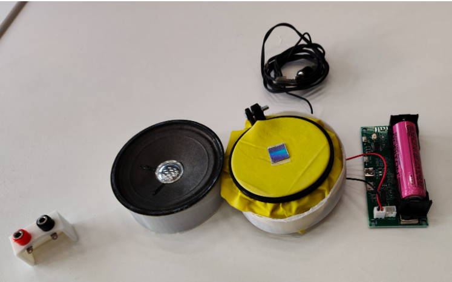

# Работа Газмагомадова Ислама
# Проект "Bluetooth колонка" на языке OpenScad

Модель для 3D-печати Bluetooth-колонки, которая используется для проведения физического опыта по визуализации звука фигурами 
Лиссажу. Экспериментальная установка состоит из динамика, расположенного горизонтально на стенках колонки, покрытого 
резиновой мембраной с закрепленным на ней в центре зеркальной пластинкой. На зеркальную пластинку напрявляется 
луч лазерной указки, а на динамик подаются сигналы звуковой частоты.
На колонке закрепляется колодка для подключения с помощью электродов типа "банан"
динамика из комплекта демонстрации фигур Хладни компании PHYWE.

Модель колодки для электродов типа "банан":

### Комплект демонстрации фигур Хладни компании PHYWE
[Комплект для эксперимента](https://www.phywe.com/ru/eksperimenty-i-nabory/universitet_10173_11104/) на официальном сайте
